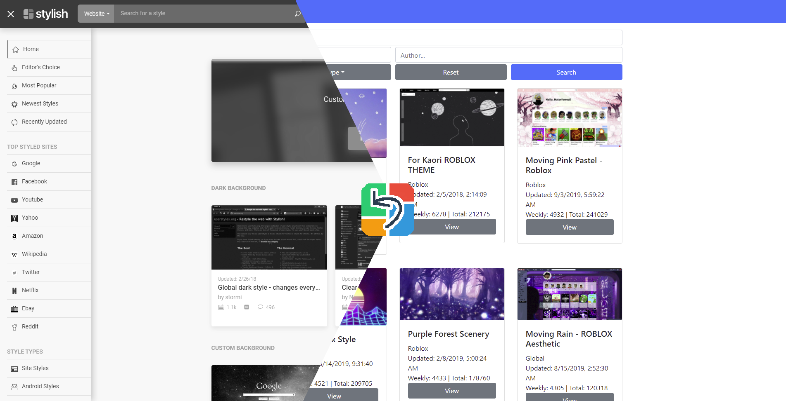

# Userstyles Redirect

This extension is a hard fork of [Old Reddit Redirect.](https://github.com/tom-james-watson/old-reddit-redirect)

The plugin will redirect you from userstyles.org to a privacy-friendly version instead, such as [33kk's Userstyles Archive](https://33kk.github.io/uso-archive/)

It is highly recommended to install Stylus, ([Chrome](https://chrome.google.com/webstore/detail/stylus/clngdbkpkpeebahjckkjfobafhncgmne), [Firefox](https://addons.mozilla.org/en-US/firefox/addon/styl-us/)) as Styl***ish*** steals your search history

# What works? What doesn't work?

## ✅ What works?
- DuckDuckGo's !bang redirect (!userstyles, !us, !ustyles)
- Whether if it's in a private or regular window, just like Old Reddit Redirect, any Userstyles query redirects to the archive instead.

## ❎ What doesn't work?
- DuckDuckGo's !bang redirect ***with*** a search query (!us ~~youtube~~, !ustyles ~~youtube~~, !userstyles ~~youtube~~)
- Clicking the "UserStyles.org" button on any style preview (redirects to home menu instead)

# How to install

Go to the [Releases](https://github.com/RoboMolluskKing/usa-redirect/releases) and download the source code. Extract the source code into it's individual folder.

- For Chrome, go to your Extensions, enable `Developer Options`, then click `Load unpacked` and select the extracted source code.
- For Firefox, go to `about:debugging`, then `This Firefox`. Under Temporary Extensions, click on `Load Temporary Add-on`. Select the extracted source code. Keep in mind, this will remove the plugin once you close out Firefox.

###### Keep in mind

I'm new to GitHub. This is my first fork to play around. So don't expect much from me 😉
